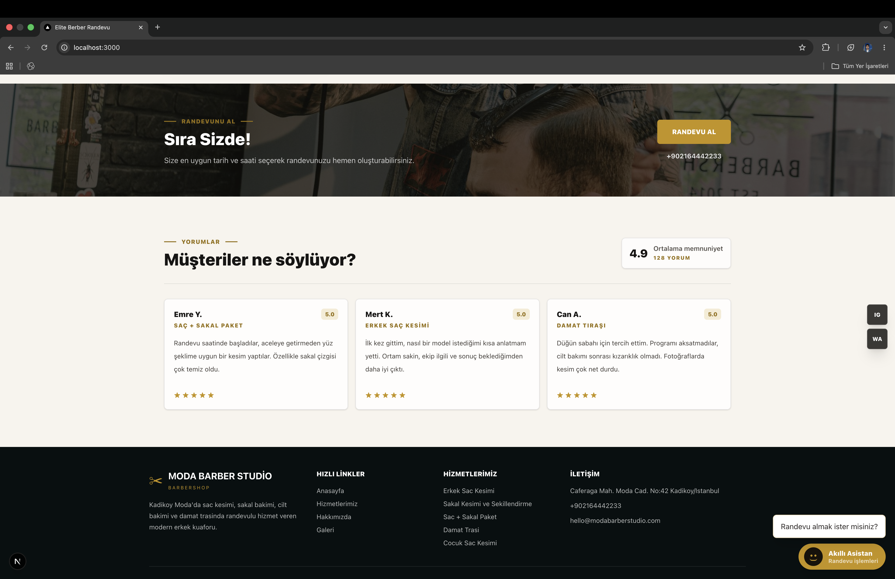
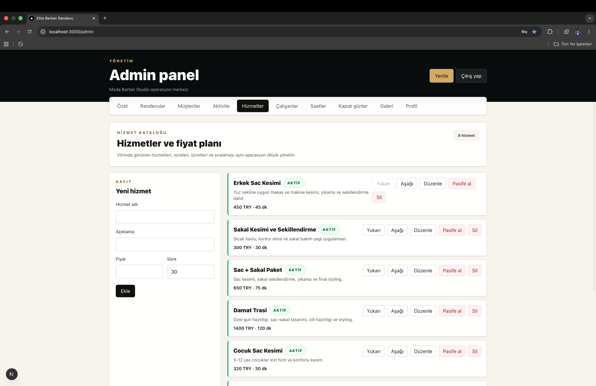

<div align="center">

# Randevu Sistemi · Appointment Management Platform

**Multi-tenant SaaS appointment platform for service businesses** — barbershops, clinics, law offices, beauty centers and more.

[Türkçe](#türkçe) · [English](#english) · [API Contract](./API.md)


</div>

---

## English

### Overview

A modern, scalable appointment management platform built with a **single backend, multiple frontends** architecture. Every service business gets the same codebase customized through environment variables and domain configuration — no code forks.

- **Customers** book appointments without creating an account (SMS OTP verification).
- **Businesses** manage everything from a unified admin panel: services, staff, hours, gallery, statistics.

### Highlights

- **Multi-tenant by design** — one codebase serves every tenant; isolation via `businessId` (single DB) or per-tenant deployments (multi DB).
- **No `businessId` in frontend requests** — backend resolves the tenant from domain, JWT, or static config.
- **OTP-based customer flow** — appointment create / cancel are confirmed via SMS, no signup required.
- **Theme-driven UI** — each tenant configures color, logo, business name from a single `.env`.
- **Built-in chatbot endpoint** for guided customer flows.
- **Admin dashboard** with daily / weekly / monthly statistics and revenue reports.

### Tech Stack

| Layer       | Technology |
| ----------- | ---------- |
| Backend     | Spring Boot 4.0.6 · Java 21 · Spring Security (JWT) · Lombok |
| Frontend    | Next.js 16.2.4 · React 19 · TypeScript 5 · Tailwind CSS |
| Database    | PostgreSQL |
| Auth        | JWT (admin) · SMS OTP (customers) |
| Storage     | Local file uploads (logo, employees, gallery) |

### Architecture

```
┌──────────────────────┐      ┌──────────────────────┐      ┌──────────────────┐
│  Next.js Frontend    │ ───► │  Spring Boot API     │ ───► │   PostgreSQL     │
│  (per-tenant theme)  │      │  /api/v1             │      │                  │
└──────────────────────┘      └──────────────────────┘      └──────────────────┘
        ▲                              │
        │                              ▼
   tenant-specific             tenant resolved from
   `.env` (theme,              domain · JWT · static
   API URL, type)              config — never from body
```

**Two deployment models:**

1. **Separate-system model** — each business gets its own backend + database.
2. **SaaS model** — single backend + single database, partitioned by `businessId` column.

Switching between models requires **zero code changes**.

### Screenshots

#### Landing page




#### Services & booking assistant

| Services | Booking assistant (chatbot) |
| --- | --- |
|  |  |

#### Admin panel

| Admin login | Dashboard |
| --- | --- |
|  |  |

| Management screens | Gallery management |
| --- | --- |
|  |  |

### Feature matrix

**Public (no auth)**

- Business profile, services, employees, gallery
- Available time slots (by service / optional employee)
- Appointment request → SMS OTP → confirm
- Phone-based appointment lookup
- Appointment cancellation with SMS OTP
- Chatbot entry point

**Admin (JWT)**

- Service CRUD + active/inactive toggle
- Employee CRUD with service assignments
- Working hours (business-wide + per-employee)
- Closed days (business-wide + per-employee)
- Appointment CRUD: create, update, cancel, complete, no-show
- Business profile & theme management
- Gallery management with ordered display
- File uploads (logo, employee photos, gallery)
- Dashboard: today / tomorrow / weekly / monthly counts + monthly revenue

### Getting started

```bash
# Backend
cd backend
cp src/main/resources/application.example.properties src/main/resources/application.properties
./mvnw spring-boot:run

# Frontend
cd frontend
npm install
npm run dev
```

Frontend runs on `http://localhost:3000`, backend on `http://localhost:8080/api/v1`.

> `application.properties` is gitignored — create it locally with PostgreSQL connection settings and JPA config.

### API contract

Full REST API contract (Turkish) lives in [`ReadME.md`](./API.md). Standard envelope:

```json
{ "success": true, "message": "...", "data": {}, "errors": [] }
```

### Project structure

```
RandevuSistemi/
├── backend/          # Spring Boot API
│   ├── src/
│   └── uploads/      # Logo / employee / gallery files
├── frontend/         # Next.js app (per-tenant build)
│   └── src/
│       ├── app/      # /, /randevu, /randevularim, /admin
│       ├── components/
│       └── hooks/
├── docs/             # Backend design notes
├── screenshots/      # README screenshots
├── ReadME.md         # Full API contract
└── SHOWCASE.md       # This file
```

---

## Türkçe

### Genel Bakış

Hizmet odaklı işletmeler için geliştirilen, **tek backend / çok arayüz** mimarisine sahip, ölçeklenebilir bir randevu yönetim platformu. Berber, klinik, avukatlık bürosu, güzellik merkezi, diş kliniği gibi farklı sektörler aynı kod tabanını kullanır; özelleştirme yalnızca konfigürasyon ile yapılır.

- **Müşteriler** hesap açmadan, SMS doğrulama ile randevu alır.
- **İşletmeler** tüm operasyonu tek bir admin panelinden yönetir.

### Öne Çıkan Özellikler

- **Multi-tenant mimari** — tek kod tabanı, tüm tenantlar; `businessId` ile ayrım veya tenant başına ayrı deploy.
- **Frontend `businessId` göndermez** — backend tenant'ı domain, JWT veya statik konfigürasyondan çözer.
- **OTP tabanlı müşteri akışı** — randevu oluşturma/iptal SMS ile doğrulanır, üyelik gerekmez.
- **Tema odaklı UI** — her tenant `.env` üzerinden renk, logo ve isim ayarlar.
- **Chatbot endpoint'i** ile yönlendirmeli müşteri akışı.
- **Admin dashboard** — günlük / haftalık / aylık istatistik ve gelir raporu.

### Teknoloji

| Katman   | Teknoloji |
| -------- | --------- |
| Backend  | Spring Boot 4.0.6 · Java 21 · Spring Security (JWT) · Lombok |
| Frontend | Next.js 16.2.4 · React 19 · TypeScript 5 · Tailwind CSS |
| Veritabanı | PostgreSQL |
| Auth     | JWT (admin) · SMS OTP (müşteri) |
| Storage  | Yerel dosya yükleme (logo, çalışan, galeri) |

### Mimari

```
┌──────────────────────┐      ┌──────────────────────┐      ┌──────────────────┐
│  Next.js Frontend    │ ───► │  Spring Boot API     │ ───► │   PostgreSQL     │
│  (tenant teması)     │      │  /api/v1             │      │                  │
└──────────────────────┘      └──────────────────────┘      └──────────────────┘
        ▲                              │
        │                              ▼
   tenant'a özel               tenant; domain · JWT ·
   `.env` (tema, API,          statik config'den çözülür
   tip)                        — request body'sinden DEĞİL
```

**İki dağıtım modeli:**

1. **Ayrı sistem modeli** — her işletme kendi backend + database deploy'una sahip olur.
2. **SaaS modeli** — tek backend + tek database, `businessId` kolonu ile partition.

Modeller arası geçiş **kod değişikliği gerektirmez**.

### Ekran Görüntüleri

#### Ana sayfa


#### Hizmetler & randevu asistanı

| Hizmetler | Randevu asistanı (chatbot) |
| --- | --- |
|  |  |

#### Admin panel

| Panel girişi | Dashboard |
| --- | --- |
|  |  |

| Yönetim ekranları | Galeri yönetimi |
| --- | --- |
|  |  |

### Özellik matrisi

**Public (auth yok)**

- İşletme profili, hizmetler, çalışanlar, galeri
- Müsait saat sorgulama (hizmet bazlı / opsiyonel çalışan)
- Randevu ön kaydı → SMS OTP → onay
- Telefon ile randevu sorgulama
- SMS OTP ile randevu iptali
- Chatbot başlangıç akışı

**Admin (JWT)**

- Hizmet CRUD + aktif/pasif toggle
- Çalışan CRUD + hizmet ataması
- Çalışma saatleri (işletme + çalışan bazlı)
- Kapalı günler (işletme + çalışan bazlı)
- Randevu CRUD: oluştur, güncelle, iptal, tamamla, gelmedi
- İşletme profili & tema yönetimi
- Sıralı galeri yönetimi
- Dosya upload (logo, çalışan fotoğrafı, galeri)
- Dashboard: bugün / yarın / haftalık / aylık sayılar + aylık ciro

### Başlangıç

```bash
# Backend
cd backend
cp src/main/resources/application.example.properties src/main/resources/application.properties
./mvnw spring-boot:run

# Frontend
cd frontend
npm install
npm run dev
```

Frontend `http://localhost:3000`, backend `http://localhost:8080/api/v1` adreslerinde çalışır.

> `application.properties` gitignored — yerel olarak PostgreSQL bağlantısı ve JPA ayarları ile oluşturulmalı.

### API kontratı

Tüm REST API kontratı [`ReadME.md`](./API.md) içinde. Standart response zarfı:

```json
{ "success": true, "message": "İşlem başarılı", "data": {}, "errors": [] }
```

### Proje yapısı

```
RandevuSistemi/
├── backend/          # Spring Boot API
│   ├── src/
│   └── uploads/      # Logo / çalışan / galeri dosyaları
├── frontend/         # Next.js uygulaması (tenant başına build)
│   └── src/
│       ├── app/      # /, /randevu, /randevularim, /admin
│       ├── components/
│       └── hooks/
├── docs/             # Backend tasarım notları
├── screenshots/      # README ekran görüntüleri
├── ReadME.md         # Tam API kontratı
└── SHOWCASE.md       # Bu dosya
```

---

<div align="center">

Made by [Ilker Kalecik](https://github.com/ilkerkalecik)

</div>
